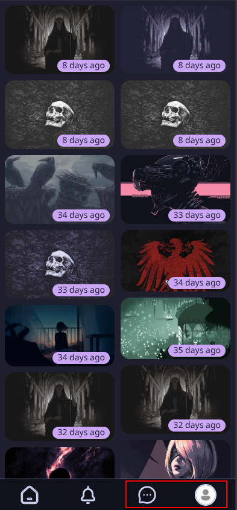
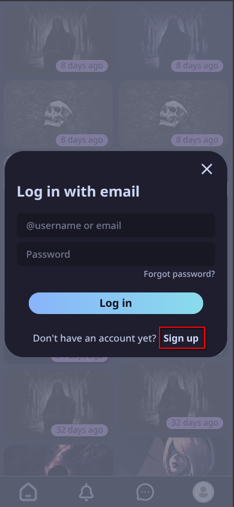

# hruych
## Інструкція з розгортання та використання
### Системні вимоги
Для розгортання застосунку необхідно мати встановлено:
* Node.js v16+ та npm;
* PostgreSQL v12+;
* Git для клонування репозиторію;
* браузер з підтримкою ES6+ (Chrome, Firefox, Safari, Edge).
### Розгортання серверної частини
#### Крок 1. Клонування репозиторію та встановлення залежностей
```
git clone https://github.com/svinoshpatel/hruych.git
cd hruych/backend
npm install
```
#### Крок 2. Конфігурація .env файлу
Створити файл `.env` в директорії `backend/` з наступним вмістом:
```
PORT=3000
DB_HOST=localhost
DB_USER=your_username
DB_PASSWORD=your_password
DB_NAME=your_database
SECRET=jwt_secret
```
Змінити `your_username`, `your_password`, `your_database`, `jwt_secret` на реальні значення.
#### Крок 3. Створення бази даних
Запустити psql:
```
psql -U postgres
```
У програмі ввести:
```
CREATE DATABASE hruych;
```
Вийти з psql. Виконати відновлення бази даних з резервної копії:
```
cd ../db
psql -U postgres -d hruych < hruych_backup_final.sql
```
#### Крок 4. Запуск серверу
```
cd ../backend
npm run dev
```
### Розгортання клієнтської частини
#### Крок 1. Встановлення залежностей
```
cd ../frontend
npm install
```
#### Крок 2. Запуск
```
npm run dev
```
Клієнт запуститься на http://localhost:5173.
Рекомендовано використовувати в режимі браузера, що імітує розміри мобільного пристрою для правильного відображення інтерфейсу.
### Використання системи
#### Реєстрація нового користувача
1. Натиснути на іконку чату або профілю.

  

2. У вікні, що відкрилось, перейти до форми реєстрації.

  

3. Заповнити форму.
#### Вхід в систему
Для входу в систему потрібно виконати кроки 1 і 3 попереднього пункту.
#### Створення аукціону
1. Натиснути на профіль користувача на навігаційній панелі.
2. Натиснути кнопку “+” в нижньому правому куті сторінки.
3. Заповнити форму.
4. Натиснути кнопку “Create”.
#### Розміщення ставки
1. На головній сторінці натиснути на картку активного аукціону.
2. На сторінці аукціону натиснути кнопку Bid.
3. Заповнити форму бажаною сумою.
4. Натиснути Bid.
5. Підтвердити вибір.
